# C++联网对战五子棋

---

**实现的功能：**

1. 两位玩家联网下棋
2. 同一个房间内玩家、观战者进行文字聊天
3. 人机对战（AI）
4. 指定房间号，观看他人下棋
5. 附加功能：玩家交换黑白棋、更换棋盘背景、游戏截图保存

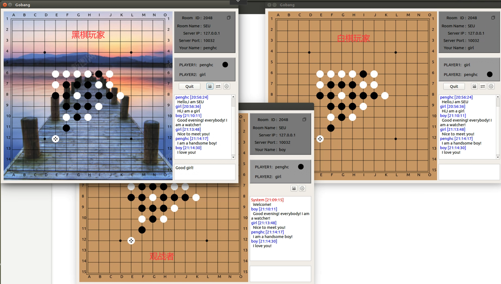

## 一、项目部署

部署环境：`Linux16.04`	`Qt 5.14.0` 	`xmake 2.7.6`

1. 开放本机端口`10032`

   > （1）查看防火墙状态，查看开放的端口
   >
   > ```bash
   > sudo ufw status
   > ```
   >
   > （2）开放端口
   >
   > ```bash
   > # sudo ufw allow 端口号
   > sudo ufw allow 10032
   > ```

2. 使用`wget`安装`xmake`，并编译

   ```C++
   bash <(wget https://xmake.io/shget.text -O -)
   ```

   ```bash
   cd Gobang\GobangServer
   # 执行xmake
   xmake
   ```

3. 启动`GobangServer`服务端

   ```bash
   Gobang\GobangServer$ ./gobang_server 127.0.0.1
   ```

4. 用Qt打开`Gobang\Gobang\Gobang.pro`，并构建、运行

## 二、功能展示

### 2.1 创建房间

> 1. 填写房间名称
>
> 2. 添加创建人名称
>
> 3. 添加服务器`ip`和端口号（注：这里端口号被我写死了，固定为10032）
>
>    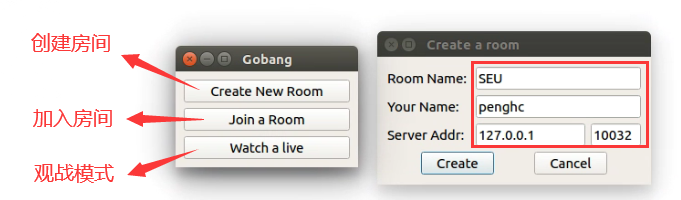
>
> 4. 进入房间，可在右上角查看显示的房间信息，左侧为棋盘，右下角为聊天室
>
>    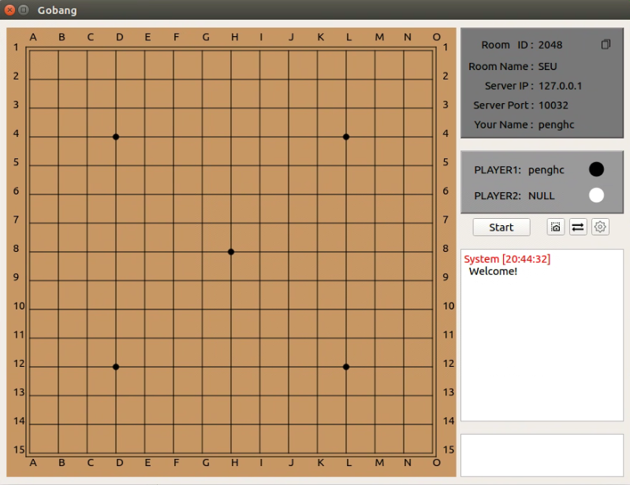
>
>    

### 2.2 加入房间

> 1. 填写正确的房间号（Room ID）加入对应的房间
>
>    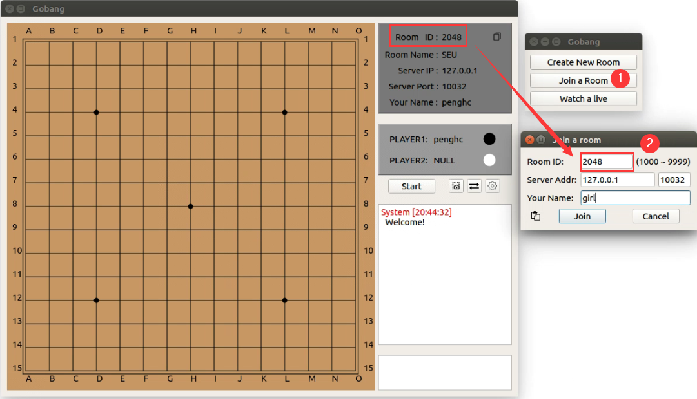
>
> 2. 玩家显示效果
>
>    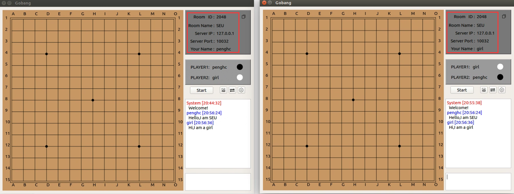
>
> 注：创建房间的玩家默认执黑棋，加入房间的玩家默认执白棋。根据五子棋规则，执黑棋的玩家先下。玩家在比赛开始之前可以交换黑白棋。

### 2.4 玩家对局

> 1. 双方均需要点击start开始按钮，表示准备完毕
>
> 2. 查看对局信息
>
>    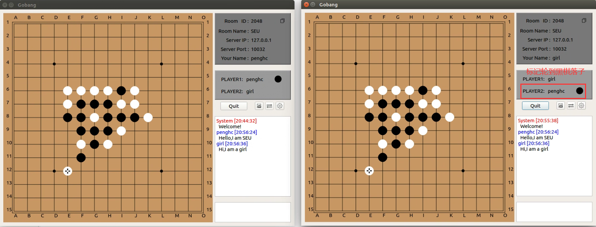

### 2.5 观看对局

> 1. 输入对应的房间号，观看对局
>
>    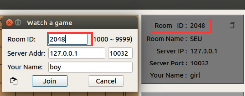
>
> 2. 观战效果
>
>    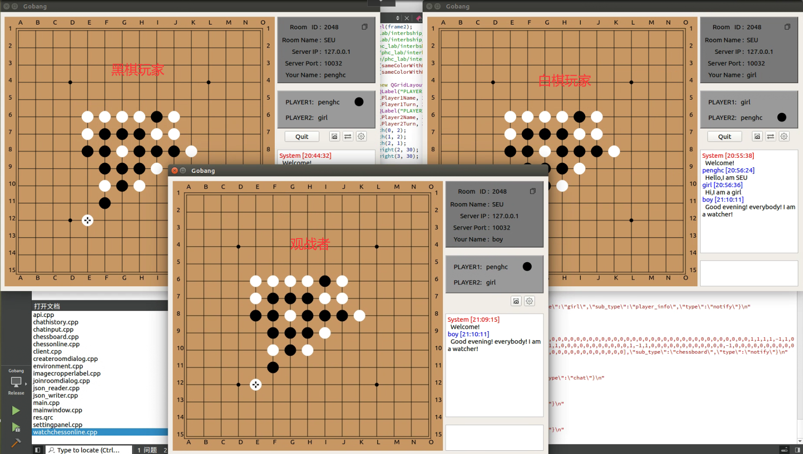

### 2.6 文字聊天

> 在同一个房间内，玩家、观战者均可以在界面的右下角发表评论
>
> 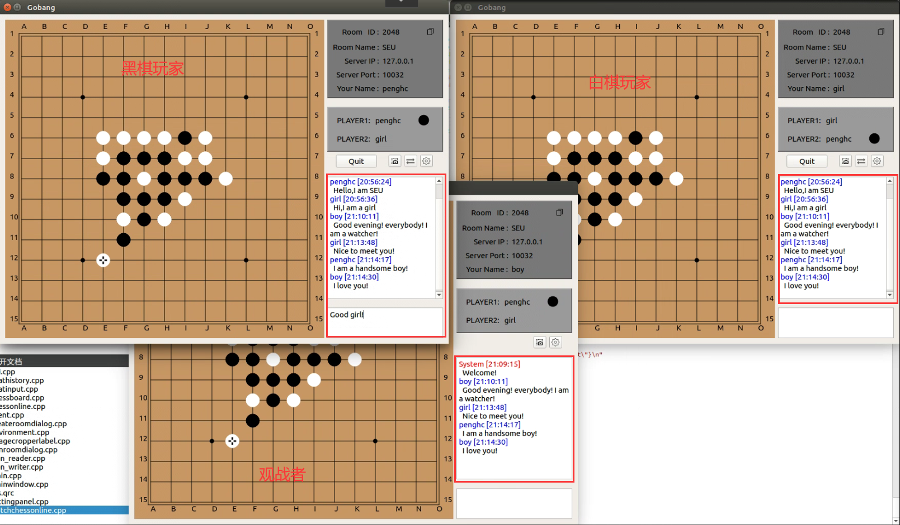

### 2.7 其他功能

#### 2.7.1 玩家交换黑白棋

注：黑白棋交换功能只能发生在双方刚开始对战的时刻！

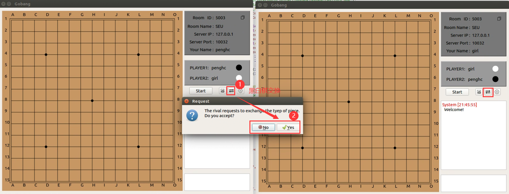

#### 2.7.2 更换棋盘背景

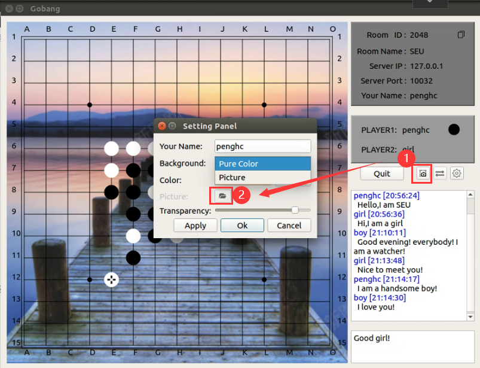

#### 2.7.3 游戏截图保存

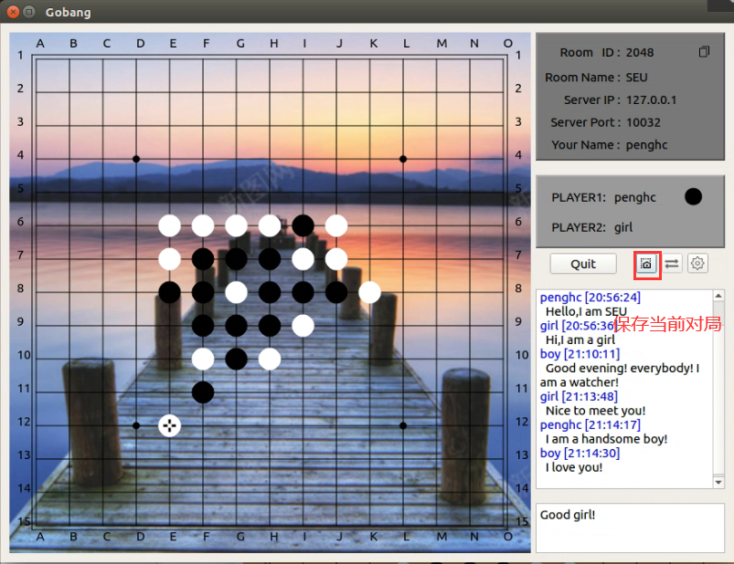
