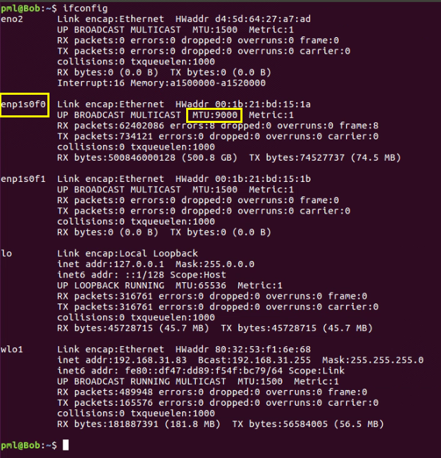

# LTE-D 安全通信系统

---

## 一、系统简介

> 本课题需要研究面向`V2X LTE-D`标准的无线物理层安全通信技术，为车与车之间以及车与路边单元之间的无线通信提供数据保密保护。基于提取的无线信道的`CSI`（`Channel State Information`，信道状态信息），在通信双方之间建立互易的`CSI`，并将CSI转换为高质量的密钥，用此密钥及祖冲之（`ZUC`）流密码算法实现无线信道数据的加密传输。
>
> 
>
> USRP软件无线电平台设备可以为X310或者N210。上位机处理机使用Linux操作系统Ubuntu16.04。相关运行的参数在系统的界面上显示。密钥分发系统通过MQTT协议和架设的服务器进行沟通，实现信息的交互。
>
> 运行效果：
>
> 1. Alice端
>
>    
>
> 2. Bob端
>
>    

## 二、系统安装过程

主机需安装Ubuntu 16.04系统，在此基础上安装软件无线电平台相关的驱动UHD和控件`GNURadio`。完成后安装LTE-D安全通信原型系统并完成编译。

### 2.1 安装`UHD3.11.1`驱动

> 1. 更新软件包列表，更新系统软件
>
>    ```bash
>    sudo apt-get update
>    sudo apt-get upgrade
>    ```
>
>    将软件和更新的安装更新选项勾选上
>
>    
>
> 2. 安装依赖源(仅适用于`Ubuntu 16.04`，其他版本需要的依赖包会有所不同)
>
>    ```bash
>    # 以下依赖源来自:https://wiki.gnuradio.org/index.php?title=UbuntuInstall
>    sudo apt-get -y install git-core cmake g++ python-dev swig \
>    pkg-config libfftw3-dev libboost-all-dev libcppunit-dev libgsl0-dev \
>    libusb-dev libsdl1.2-dev python-wxgtk3.0 python-numpy \
>    python-cheetah python-lxml doxygen libxi-dev python-sip \
>    libqt4-opengl-dev libqwt-dev libfontconfig1-dev libxrender-dev \
>    python-sip python-sip-dev python-qt4 python-sphinx libusb-1.0-0-dev \
>    libcomedi-dev libzmq-dev
>    ```
>
> 3. 创建安装`UHD`的文件目录
>
>    ```bash
>    cd $HOME
>    mkdir workarea-uhd
>    cd workarea-uhd
>    ```
>
> 4. 从Github下载UHD源码(需在linux 上配置git环境，使用ssh远程登录github)
>
>    ```bash
>    git clone https://github.com/EttusResearch/uhd
>    cd uhd
>    git checkout v3.11.1.0
>    ```
>
> 5. 编译并安装UHD（这一步所需的时间较长）
>
>    ```bash
>    cd host
>    mkdir build
>    cd build
>    cmake ../
>    make
>    make test
>    sudo make install
>    sudo ldconfig
>    ```
>
> 6. 配置环境变量
>
>    打开/etc/bash.bashrc 文件，在文件的最后添加export LD_LIBRARY_PATH=/usr/local/lib，保存。
>
>    若权限不够，则先输入如下命令再配置：
>
>    ```bash
>    sudo chmod 777 /etc/bash.bashrc
>    ```
>
> 7. 下载FPGA 镜像
>
>    ```bash
>    sudo uhd_images_downloader
>    ```

### 2.2 安装GNIRadio3.7.11

> 1. 使用源码安装(建立文件目录并且从GitHub上获得源码)
>
>    ```bash
>    cd $HOME
>    mkdir workarea-gnuradio
>    cd workarea-gnuradiogit clone -recursive https://github.com/gnuradio/gnuradio
>    cd gnuradio
>    git checkout v3.7.11
>    git submodule update -init -recursive
>    mkdir build
>    cd build
>    cmake ../
>    make
>    make test
>    sudo make install
>    sudo ldconfig
>    ```
>
> 2. 测试USRP是否已经连接
>
>    输入 sudo gnuradio-companion 命令打开GNURadio。
>
>    在终端中用 sudo uhd_usrp_probe，测试USRP是否已经连接成功。

### 2.3 初始MQTT环境的配置

> 1. 安装paho.mqtt.c
>
>    ```bash
>    cd ~/
>    git clone https://github.com/eclipse/paho.mqtt.c.git
>    cd paho.mqtt.c
>    make
>    sudo make install
>    ```
>
>    成功的话，会在paho.mqtt.c/build/output下可以找到各种动静态链接。
>
>    补充: 若在make的时候出现以下错误提示：
>
>    ```bash
>    In file included from src/Socket.c:33:0:
>    src/SocketBuffer.h:28:25: fatal error: openssl/ssl.h: No such file or directory
>    compilation terminated.
>    ```
>
>    导致这种情况的原因是：openssl环境没有配置正确，此时需要通过如下命令来安装OpenSSL 开发包：
>
>    ```bash
>    sudo apt-get install libssl-dev
>    ```
>
> 2. 初始化日志系统
>
>    （1）gflags
>
>    ```bash
>    git clone https://github.com/gflags/gflags.git
>    cd gflags
>    mkdir build
>    cd build
>    cmake -DGFLAGS_NAMESPACE=google -DCMAKE_CXX_FLAGS=-fPIC -DBUILD_SHARED_LIBS=ON ..
>    make -j4
>    sudo make install
>    sudo ldconfig
>    ```
>
>    （2）glog
>
>    ```bash
>    # git clone https://github.com/boboxxd/glog.git
>       git clone https://github.com/google/glog # 主要区别是cnmake版本
>    cd glog
>    mkdir build
>    cd build
>    cmake ../ && make && sudo make install

### 2.4 安装LTE-D安全通信系统程序

> 1. 下载项目源码
>
>    ```bash
>    cd ~/ # 打开终端，切换到用户目录
>    git clone -b V2X-ZUC git@gitee.com:phc-seu/ROI.git
>    ```
>
> 2. 安装子模块gr-roi
>
>    ```bash
>    cd ~/ROI/GModule/gr-roi # 切入gr-roi子模块目录
>    git submodule update --init # 拉取子模块
>    # 若出现提示:Submodule path './': checked out ……，则说明拉取子模块成功
>    mkdir build # 新建build目录，用于编译安装模块
>    cd build # 切换到build目录
>    cmake ../ && make && sudo make install && sudo ldconfig # 编译安装gr-roi模块
>    ```
>
>    修改 ~/gnuradio/lib/cmake/gnuradio/GnuradioConfig.cmake文件 ，仿照其他模块，加入
>
>    ```bash
>    GR_MODULE(ROI gnuradio-roi roi/api.h gnuradio-roi)
>    ```
>
> 3. 编译运行LTE-D安全通信系统程序
>
>    ```bash
>    cd ROI # 切入ROI文件夹
>    mkdir build # 新建build目录，用于编译
>    cd build # 切换到build目录
>    cmake ../ && make # 编译
>    cd ../bin # 切换到ROI源码目录下的bin目录,可以看到有一个名为ROI的可执行文件
>    ./ROI # 命令行运行该可执行文件（或者图像界面切换到该目录下，双击允许该文件）
>    ```
>
>    若出现《LTE-D安全通信原型系统》程序的图形界面，则说明上述系统编译运行成功。
>
> 4. 程序初始化
>
>    （1）读/写的缓冲区大小修改
>
>    ```bash
>    sudo sysctl -w net.core.wmem_max=33554432
>    sudo sysctl -w net.core.rmem_max=33554432
>    ```
>
>    （2）修改光纤口的`MTU`，先用`ifconfg`确定光纤口的名称
>
>    * 示例：
>
>      ```bash
>      # Alice端
>      sudo ifconfig enp1s0 mtu 9000 up
>      # Bob端
>      sudo ifconfig enp1s0f0 mtu 9000 up
>      ```
>      
>      Alice端
>    
>    
>    
>      Bob端
>    
>    
>    

### 2.5 注意事项

> 1. 若出现roi子模块链接未找到的错误提示，则进行以下排查步骤：
>
>    （1）对于使用pybombs安装的gnuradio3.7，需要注释CMakelists.txt中的以下语句：
>
>    ```bash
>    # find_package(roi)
>    # include_directories(${ROI_INCLUDE_DIRS})
>    # ${ROI_LIBRARIES}
>    ```
>
>    （2）而对于GNURadio全局安装方式，则需要取消以上三行代码的注释
>
>    ```bash
>    find_package(roi)
>    include_directories(${ROI_INCLUDE_DIRS})
>    ${ROI_LIBRARIES}
>    ```

## 三、系统连通性测试

> 1. 测试要求
>
>    （1）`USRP-X310`软件无线电平台通过`10GB`光纤和`PC`上位机连接。
>
>    （2）`USRP-N210`软件无线电平台通过`1GB`以太网线和上位机连接。
>
>    （3）`PC`上位机需要连接具有能够连接`Internet`网的`Wi-Fi`热点以实现访问云端服务器。
>
>    （4）使用移动电源给软件无线电平台、PC上位机、信号放大器模块供电，开启相关设备。
>
> 2. 测试流程
>
>    软件无线电平台分别从`Tx/Rx`天线端口连接信号放大器模块（连接放大器模块的`from AP`端口），再将天线连接至信号放大器模块（连接放大器模块的`to Antenna`端口）。
>
>    在使用`USRP-X310`软件无线电平台时，上位机通过`ping 192.168.40.2`测试软件无线电连通状态。在使用`USRP-N210`软件无线电平台时，上位机通过`ping 192.168.10.2`测试软件无线电连通状态。当有数据交互时，表示软件无线电平台和上位机的物理连接通畅。
>
> 3. 验证云端服务器的连接状态的步骤
>
>    （1）  使用`ping+云服务器ip地址`命令检查网络连通状态，例如：`ping 47.122.3.201`
>
>    （2）  运行LTE-D安全通信原型系统程序，查看日志输出中`Alice`端是否能够通过`MQTT`服务器发布消息。

## 四、系统基本参数设置

### 4.1 Alice端参数设置

> 1. 选择TDD模式，即时分双工模式（必选）
>
> 2. 角色选择alice（必选）
>
> 3. 是否连续存储：在一次运行中Alice端生成的多组ZUC初始密钥是否存储在通一个文件中（可选，但如果勾选了随机性检测则为必选）
>
> 4. 是否存在eve：是否存在窃听方（可选）
>
> 5. CSI存储目录：Alice端根据探测信号计算得出的CSI存储地址（必选）
>
> 6. 密钥存储目录：将CSI量化为高质量密钥Ka后的存储地址（必选）
>
> 7. ZUC初始密钥存储目录： ZUC初始密钥的存储地址（必选）
>
> 8. 打开所需加密的图片：需要加密的图片的存储地址（必选）
>
> 9. 加密文字、加密图片、HARQ、维纳滤波器（可选）
>
> 10. 随机性检测：是否启用随机性检测，若勾选，则每生成40组ZUC初始密钥做一次随机性检测，结果显示在界面的右下角（可选）
>
> 11. LDPC码率：码率越小，纠错性能越好，但系统运行效率会有所下降。可选的码率为： 2/3，1/2，1/3，1/4，1/5
>
> 12. 消息：Alice发送给Bob的消息，会使用ZUC密钥流进行加密处理，支持中英文
>
> 13. PSS能量阈值、PSS相关阈值、DMRS能量阈值、DMRS相关阈值：用于检测Bob端的PSSCH信号
>
> 14. Tx增益、Rx增益：户外建议30db，户内建议10-25db
>
> 15. 采样率：USRP-X310支持1000-30720KHz，USRP-N210支持1000-25000KHz
>
> 16. 载波：不能与wifi等载波频率一致，单位为MHz
>
> 17. 重发间隔：Alice端从一次发送PSBCH_PSSCH探测信号到下一次发送PSBCH_PSSCH探测信号的时间，单位为ms
>
> 18. 设备地址：通过查看本机连接信息选择设备地址ip。例如这里选择的是192.168.40.1
>
>     
>
> 参数设置样例：
>
> 

### 4.2 Bob端参数设置

> 1. 选择TDD模式，即时分双工模式（必选）
>
> 2. 角色选择bob（必选）
>
> 3. CSI存储目录：Bob端根据探测信号计算得出的CSI存储地址（必选）
>
> 4. 密钥存储目录：将CSI量化为高质量密钥Kb后的存储地址（必选）
>
> 5. ZUC初始密钥存储目录： ZUC初始密钥的存储地址（必选）
>
> 6. 加密文字、加密图片、HARQ、维纳滤波器、随机性检测、LDPC码率：根据Alice端的参数进行相同设置
>
> 7. 消息：Bob端接收到的经过解密后的消息
>
> 8. PSS能量阈值、PSS相关阈值：用于检测Alice端的PSSCH信号；
>
>    DMRS能量阈值、DMRS相关阈值参数用不到
>
>    9. Tx增益、Rx增益：户外建议30db，户内建议10-25db
>9. 采样率：需与Alice端参数保持一致
>9. 载波：需与Alice端参数保持一致
>9. 重发间隔：Bob端从检测到Alice端的探测信号到发送自身信号所间隔的时间，单位为ms 
> 9. 设备地址：通过查看本机连接信息选择设备地址ip
>
> 参数设置样例：
>
> 
>
> Alice和Bob端分别点击“运行”后，系统开始工作。
>
> 当通信双方程序界面右上角显示连续的`CSI`图像且右下角显示“第x次生成zuc初始密钥成功”字样时，则表示表示系统基本参数设置正确，系统可以正常工作。

## 五、无线信道生成密钥测试

### 5.1 静止测试环境下

> 在静止测试环境下。Alice和Bob终端在室外环境中距离约100米。在Alice和Bob端点击“运行”开始生成密钥。系统基于生成的密钥对XXX界面中的文字信息和图片信息进行ZUC加密传输。在运行主界面中分别显示了系统的运行时间，已生成密钥数，生成加密密钥时间，ZUC密钥协商时间以及ZUC加密和解密时间（在系统中将信息改成这个，比较直观）。系统连续生成40组密钥后将运行随机性检测模块并统计检测算法通过数量，检测结果见运行主界面。系统连续运行20分钟后通过统计密钥生成数量计算密钥生成速率。

 ### 5.2 `5km/h`测试环境

> 在人推小车走动（5km/h）测试环境下。Alice和Bob终端在室外环境中距离约100米。其中一端放在可移动的小推车上由人推动。在Alice和Bob端点击“运行”开始生成密钥。系统基于生成的密钥对运行主界面中的文字信息和图片信息进行ZUC加密传输。在XXX界面中分别显示了系统的运行时间，已生成密钥数，生成加密密钥时间，ZUC密钥协商时间以及ZUC加密和解密时间（在系统中将信息改成这个，比较直观）。系统连续生成40组密钥后将运行随机性检测模块并统计检测算法通过数量，检测结果见运行主界面。系统连续运行20分钟后通过统计密钥生成数量计算密钥生成速率。

 ### 5.3 `30km/h`测试环境下

> 在车载运动（速度低于30km/h）测试环境下。Alice和Bob终端在室外环境中距离约100米。其中一端放在汽车载具内并以不高于30km/h的速度移动。在Alice和Bob端点击“运行”开始生成密钥。系统基于生成的密钥对运行主界面中的文字信息和图片信息进行ZUC加密传输。在运行主界面中分别显示了系统的运行时间，已生成密钥数，生成加密密钥时间，ZUC密钥协商时间以及ZUC加密和解密时间（在系统中将信息改成这个，比较直观）。系统连续生成40组密钥后将运行随机性检测模块并统计检测算法通过数量，检测结果见运行主界面。系统连续运行20分钟后通过统计密钥生成数量计算密钥生成速率。

## 附加笔记

### 1 使用ssh远程登录github

> 1. 打开终端
>
>    ```bash
>    ssh-keygen -t rsa -C "3207161176@qq.com"   #邮箱为你的github注册邮箱
>    ```
>
> 2. 在终端中连续按下回车表示默认
>
> 3. 在~/目录下会出现一个.ssh文件，复制密钥
>
>    ```bash
>    cat ~/.ssh/id_rsa.pub
>    ```
>
> 4. 打开自己的github账户依次选择：`settings -> SSH and GPG keys -> New SSH key`
>
> 5. 将第3步复制的密钥粘贴到github的`Key`中，随便输入一个`Title`，按下`Add SSH Key`按钮
>
> 6. 回到终端，在本地添加SSH密钥
>
>    ```bash
>    eval `ssh-agent` 
>    ssh-add
>    ```
>
> 7. 测试git是否连通远程的github账户
>
>    ```bash
>    ssh -T git@github.com
>    ```
>
>    成功则会出现如下提示
>
>    ```bash
>    $ ssh -T git@github.com
>    Hi Peng-HC! You've successfully authenticated, but GitHub does not provide shell access.
>    ```


