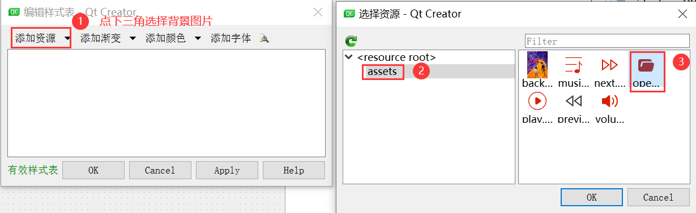
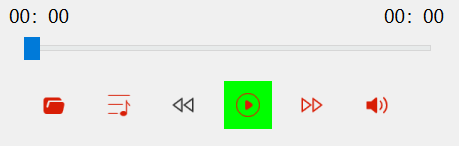

# Qt 音乐播放器

---

**实现的功能：**

1. 选择文件夹中的歌单
2. 展示歌单
3. 切换歌曲（上一曲，下一曲，双击歌单列表）
4. 播放和暂停歌曲
5. 实时获取歌曲的时间和总时长，并通过滑块进行形象展示
6. 拖动滑块实时改变歌曲进度


## 一、前期准备

注意事项：

（1）项目的创建过程中不允许有中文路径！

（2）Qt 的版本需为6.0以上，这里我使用的是`Qt 6.2.4`

### 1. 创建Qt项目


### 1.2 导入资源文件


最后选中其中一个.png文件右键选择“复制资源路径到剪切板”即可

## 二、Qt界面构造

1. 将`button`控件的背景修改为资源文件中的png图片

   （1）选中要修改的button控件，右键选择“改变样式表”

   （2）编辑样式表

   

   （3）去除按钮控件的所有边框，且当用户鼠标悬浮在按钮上时，修改按钮的背景颜色

   

   在编辑样式表中写入css样式：

   ```css
   QWidget{
   }
   QListWidget{
       background-image: url(:/assets/background.png);
   }
   QPushButton
   {
       border:none;
   }
   QPushButton:hover 
   {
       background-color:rgb(0,255,0);
   }
   ```
   
   （4）效果图
   
   


2. 新建`ListWidget`控件

   

3. 新建音乐进度条`horizontalSlider`

   

4. 添加当前音乐播放时间和总时长

   

   

5. `Widget`图标和标题修改

   修改`main.cpp`为如下代码：

   ```C++
   #include "widget.h"
   #include <QIcon>
   
   #include <QApplication>
   
   int main(int argc, char *argv[])
   {
       QApplication a(argc, argv);
       QIcon icon("../Qt_MusicPlayer/assets/musicIcon.png");
       Widget w;
       w.setWindowTitle("PHC的音乐播放器");
       w.setWindowIcon(icon);
       w.show();
       return a.exec();
   }
   ```

## 三、选择文件夹中的mp3,wav文件功能

1. 右键选择“转到槽”


2. 选择点击事件信号


3. 在`widget.cpp`中写入逻辑处理

   ```c++
   //打开文件夹对话框
   void Widget::on_openDir_pushButton_clicked()
   {
       qInfo()<<"打开文件夹对话框";
       //打开文件对话框，让用户选择选择音乐所在的目录
       //默认打开的目录：../Qt_MusicPlayer/assets/music
       QString path = QFileDialog::getExistingDirectory(this,"请选择音乐所在的目录","../Qt_MusicPlayer/assets/music");
       //qInfo()<<path;
       QDir dir(path);
       //根据拿到的路径，获取里面所有的mp3,wav格式的文件
       QStringList musicList = dir.entryList(QStringList()<<"*.mp3"<<"*.wav");
       //qInfo()<<musicList;
       //把音乐名字放到列表上展示
       ui->musicListWidget->addItems(musicList);
       //默认选中列表的第一个
       ui->musicListWidget->setCurrentRow(0);
       //把音乐的完整路径保存起来
       for(auto musicFileURL : musicList) {
           playList.append(QUrl::fromLocalFile(path+"/"+musicFileURL));
       }
   //    qInfo()<<playList;
   }
   ```

## 四、切歌功能

> 1. 用户点击上一曲
>
>    ```C++
>    //上一曲
>    void Widget::on_previous_pushButton_clicked()
>    {
>        qInfo()<<"上一曲";
>        //未添加音乐
>        if(playList.empty()) {
>            //弹窗告警
>            QMessageBox::warning(this,"警告","请添加需要播放的音乐！");
>            return;
>        }
>        if(0==curPlayIndex) {
>            curPlayIndex=playList.size()-1;
>        } else {
>            curPlayIndex--;
>        }
>        ui->musicListWidget->setCurrentRow(curPlayIndex);
>        mediaPlayer->setSource((playList[curPlayIndex]));
>        mediaPlayer->play();
>    }
>    ```
>
> 2. 用户点击下一曲
>
>    ```C++
>    //下一曲
>    void Widget::on_next_pushButton_clicked()
>    {
>        qInfo()<<"下一曲";
>        //未添加音乐
>        if(playList.empty()) {
>            //弹窗告警
>            QMessageBox::warning(this,"警告","请添加需要播放的音乐！");
>            return;
>        }
>        curPlayIndex=(curPlayIndex+1)%playList.size();
>        ui->musicListWidget->setCurrentRow(curPlayIndex);
>        mediaPlayer->setSource((playList[curPlayIndex]));
>        mediaPlayer->play();
>    }
>    ```

## 五、播放和暂停功能

> 根据`QMediaPlayer`对象提供的`playbackState()`方法中的枚举类型，可以获取到当前音乐的播放状态，总共有三种，分别为
>
> （1）停止状态：`QMediaPlayer::PlaybackState::StoppedState`，当用户点击后，将播放音乐。
>
> （2）播放状态：`QMediaPlayer::PlaybackState::PlayingState`，当用户点击后，将暂停音乐。
>
> （3）暂停状态：`QMediaPlayer::PlaybackState::PausedState`，当用户点击后，将继续播放音乐。
>
> ```C++
> //播放或暂停音乐功能
> void Widget::on_play_pushButton_clicked()
> {
>     qInfo()<<"播放或暂停音乐";
>     //未添加音乐
>     if(playList.empty()) {
>         //弹窗告警
>         QMessageBox::warning(this,"警告","请添加需要播放的音乐！");
>         return;
>     }
>     switch(mediaPlayer->playbackState()) {
>     case QMediaPlayer::PlaybackState::StoppedState: {//停止状态
> //        qInfo()<<"停止状态"<<QMediaPlayer::PlaybackState::StoppedState;
>         //1.获取选中的行号
>         curPlayIndex = ui->musicListWidget->currentRow();
> //        qInfo()<<"curPlayIndex="<<curPlayIndex;
>         //2.播放对应下标的音乐
>         mediaPlayer->setSource(playList[curPlayIndex]);
>         mediaPlayer->play();
>         break;
>     }
>     case QMediaPlayer::PlaybackState::PlayingState:{//播放状态
> //        qInfo()<<"播放状态"<<QMediaPlayer::PlaybackState::PlayingState;
>         mediaPlayer->pause();
>         break;
>     }
>     case QMediaPlayer::PlaybackState::PausedState: {//暂停状态
> //        qInfo()<<"暂停状态"<<QMediaPlayer::PlaybackState::PausedState;
>         mediaPlayer->play();
>         break;
>     }
>     }
> }
> ```

## 六、其他功能

### 6.1 双击歌单播放相应的音乐

> 1. 选择`QListWidget`控件并右键选择“转到槽”
>
> 2. 选择`doubleClicked(QModelIndex)`
>
>    
>
> 3. 在`on_musicListWidget_doubleClicked`函数中编写逻辑事件
>
>    ```C++
>    //用户双击播放音乐
>    void Widget::on_musicListWidget_doubleClicked(const QModelIndex &index)
>    {
>        qInfo()<<"双击播放音乐";
>        curPlayIndex = index.row();
>        ui->musicListWidget->setCurrentRow(curPlayIndex);
>        mediaPlayer->setSource(playList[curPlayIndex]);
>        mediaPlayer->play();
>    }
>    ```

### 6.2 使用信号槽机制获取当前歌曲的时间并实时显示

> 1. 获取歌曲总时长
>
>    * 信号发送方：`QMediaPlayer`对象
>
>    * 信号：函数`QMediaPlayer::durationChanged`
>    * 信号接收方：当前`QWidget`对象
>    * 槽：界面中显示的`label`对象
>
>    ```C++
>    //获取媒体总时长，通过信号、槽机制
>    //信号发送方,信号,信号接收方,槽
>    connect(mediaPlayer,&QMediaPlayer::durationChanged,this,[=](qint64 duration) {
>        ui->totalTimeLabel->setText(QString("%1:%2")
>                                    .arg(duration/1000/60,2,10,QChar('0'))
>                                    .arg(duration/1000%10,2,10,QChar('0')));
>        musicDuration=duration;
>        //滑块
>        ui->timeSlider->setRange(0,duration);
>    });
>    ```
>
> 2. 获取歌曲当前时长
>
>    * 信号发送方：`QMediaPlayer`对象
>
>    * 信号：函数`QMediaPlayer::positionChanged`
>    * 信号接收方：当前`QWidget`对象
>    * 槽：界面中实时显示的`label`对象
>
>    ```C++
>    //获取媒体当前时长，实时更新
>    connect(mediaPlayer,&QMediaPlayer::positionChanged,this,[=](qint64 position) {
>        ui->currTimeLabel->setText(QString("%1:%2")
>                                   .arg(position/1000/60,2,10,QChar('0'))
>                                   .arg(position/1000%10,2,10,QChar('0')));
>        //滑块
>        ui->timeSlider->setValue(position);
>    });
>    ```
>
> 3. 拖动滑块，改变音乐播放的进度
>
>    * 信号发送方：界面上的滑块
>
>    * 信号：函数`QSlider::sliderMoved`
>    * 信号接收方：`QMediaPlayer`对象
>    * 槽：通过`QMediaPlayer`对象设置滑块位置的函数`setPosition`
>
>    ```C++
>    connect(ui->timeSlider,&QSlider::sliderMoved,mediaPlayer,&QMediaPlayer::setPosition);
>    ```

## 七、遇到的问题及解决方法

### 7.1 Qt版本问题

#### 7.1.1 错误描述

由于需要播放音频，所以需要使用到multimedia模块。模块的加载过程如下：

1. 在工程文件Qt_MusicPlayer.pro中添加multimedia

   ```properties
   QT       += core gui multimedia
   ```

2. 在`Sources/widget.cpp`中引入文件库

   ```C++
   #include <QMediaPlayer>
   #include <QAudioOutput>
   
   //构造函数
   Widget::Widget(QWidget *parent)
       : QWidget(parent)
           , ui(new Ui::Widget)
       {
           //构造函数
           ui->setupUi(this);
   
           //如何播放音乐
           //1.先加载multimedia模块:在工程文件Qt_MusicPlayer.pro中添加multimedia
           //2.new一个音频播放对象
           auto audioOutput = new QAudioOutput(this);
           //3.new一个媒体播放对象
           auto mediaPlayer = new QMediaPlayer(this);
           mediaPlayer->setAudioOutput(audioOutput);
   
           //4.给播放器设置音乐
           mediaPlayer->setSource(
               QUrl::fromLocalFile("assets/东南大学校歌.mp3"));
       }
   ```


3. 错误信息如下

   ```bash
   error: 'class QMediaPlayer' has no member named 'setAudioOutput'
   error: no matching constructor for initialization of 'QAudioOutput'
   error: no member named 'setAudioOutput' in 'QMediaPlayer'
   error: no member named 'setSource' in 'QMediaPlayer'
   ```


#### 7.1.2 错误原因

> Qt版本为`5.9.9`的`multimedia`模块创建的`QMediaPlayer`没有`setAudioOutput`和`setSource`函数，`QAudioOutput`类中没有参数为`QWidget*`的构造函数。这些新的特性只要在`Qt6.0`以上的版本才具备。

#### 7.1.3 解决方法

> 重装`Qt Creator9.0.1`，将Qt版本升至`6.2.4`，问题得到解决。

### 7.2 css样式覆盖问题

#### 7.2.1 错误描述

1. 设置`QWidget`的样式为：

```css
QWidget{	
    background-image: url(:/assets/background.png);
}
QPushButton
{
    border:none;
}
QPushButton:hover 
{
    background-color:rgb(0,255,0);
}
```

2. 发现`QPushButton{border:none;}`不起作用，各个控件依旧存在边框，且鼠标悬浮在`QPushButton`控件上不会更改背景色。

   

#### 7.2.2 错误原因

> 该6个`QPushButton`控件均包含在`QWidget`容器组件中，对`QWidget`设置的背景图片将对它们也造成影响，从而使得对`QPushButton`控件设置的样式失效。

#### 7.2.3 解决方法

> 方法一：该6个`QPushButton`控件包含在其他容器组件中，比如`Frame`组件
>
> 方法二：将背景图片应用在`QListWidget`控件中，修改`css`样式表如下所示
>
> ```css
> QWidget{
> }
> QListWidget{
>     background-image: url(:/assets/background.png);
> }
> QPushButton
> {
>     border:none;
> }
> QPushButton:hover 
> {
>     background-color:rgb(0,255,0);
> }
> ```
>
> 
>
> 
