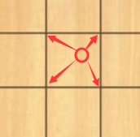

# C++人机对战五子棋

---

本项目使用了`VS2017+easyx`图形库进行开发，最终实现效果如下：


注：白棋为AI所下

## 一、前期准备


### 1.1 创建C++空项目


### 1.2 在项目中导入图片素材

1. 素材导入目录：`人机对战五子棋\res`

   

2. 素材内容

   

### 1.3 安装`easyx`图形库

简介：EasyX 是针对 C++ 的图形库，可以帮助 C/C++ 初学者快速上手图形和游戏编程。

1. [官网下载easy图形库](https://easyx.cn/)

   

2. 直达链接：https://easyx.cn/download/EasyX_20220901.exe

3. [官方安装教程](https://easyx.cn/setup)

4. [`Easyx`使用文档](https://docs.easyx.cn/zh-cn/intro)

   使用时需包含`graphics.h`头文件

## 二、项目框架设计

### 2.1 框架说明

> 根据五子棋规则，要开始一场对局需要有三个角色：真人、AI和棋盘，同时需要一个游戏控制类，框架的设计如下：
>
> 

### 2.2 根据框架设计类

> 在框架设计好后，我们可以知道我们需要创建4个类：`Man, AI, Chess, ChessGame`。创建完后，项目的目录结构如下：
>
> 

## 三、给各个类添加主要接口

### 3.1 棋盘类`Chess.h`

```C++
#pragma once
#include<graphics.h> //easyx图形库的头文件
#include<vector>
using namespace std;

//棋子的位置
struct ChessPos {
	int row; //行
	int col; //列
	//构造函数
	ChessPos(int r = 0, int c = 0) :row(r), col(c) {}
};

//棋子类型
typedef enum {
	CHESS_WHITE = -1,//白棋
	CHESS_BLACK = 1	//黑棋
}ChessType;

//棋盘类
class Chess
{
public:
	Chess(int chessboardSize, int marginX, int marginY, float chessSize);
	//棋盘初始化:加载棋盘的图片资源，初始化棋盘的相关数据
	void init();
	//判断是否为有效点击
	bool clickBoard(int x, int y, ChessPos *pos);
	//落子
	void chessDown(ChessPos *pos, ChessType chess_type);
	//获取棋盘大小(13,15,17,19)
	int getChessboardSize();
	//获取指定位置是黑棋还是白棋，还是空白
	int getChessData(ChessPos *pos);
	int getChessData(int row, int col);
	//检查棋局是否结束
	bool checkGameOver();

private:
	IMAGE chessBlackImg; //黑棋棋子
	IMAGE chessWhiteImg; //黑棋棋子

	int chessboardSize; //棋盘大小(13，15，17，19)
	int margin_x; //棋盘的左侧边界
	int margin_y; //棋盘的顶部边界
	float chessSize; //棋子的大小(棋盘小方格的大小)
	ChessPos lastPos; //最近落子位置

	//存储当前棋局的棋子分布情况
	//例如：chessMap[3][6] 表示棋盘的第3行第5列的落子情况 0:空白，1:黑子，-1:白子
	vector<vector<int>> chessMap;

	//表示现在该哪个角色下棋（落子）了
	bool playerRole; //true:黑子走，false:白子走
	//修改棋盘数据
	void updateChessMap(ChessPos *pos);
};
```

### 3.2 棋手类`Man.h`

```C++
#pragma once
#include "Chess.h"
class Man
{
public:
	void init(Chess *chess);
	//人走棋
	void go();

private:
	Chess *chess;
};
```

### 3.3 AI类`AI.h`

```C++
#pragma once
#include "Chess.h"
class AI
{
public:
	void init(Chess *chess);
	//AI走棋
	void go();
	//AI对棋盘的每个位置进行评分
	void calculateScore();
	//AI思考(返回落子的行列)
	ChessPos think();
private:
	Chess *chess;
	//存储AI在棋盘上每个位置上下棋后获得的分数，最后取最高的分数对应的位置落子
	vector<vector<int>> AI_scores;
};
```

### 3.4 棋盘类`ChessGame.h`

```C++
#pragma once
#include "Man.h"
#include "Man2.h"
#include "AI.h"
#include "Chess.h"

class ChessGame
{
public:
	//构造函数对数据进行初始化
	ChessGame(Man* man, AI* ai, Chess* chess);
	ChessGame(Man* man, Man2* man2, Chess* chess);
	//开始对局
	void play();
private:
	Man* man;
	Man2* man2;
	AI* ai;
	Chess* chess;
};
```

### 3.5 主程序`Main.cpp`

```C++
/*
	使用图形库来显示棋盘、棋子等：easyx
	EasyX 是针对 C/C++ 的图形库，可以帮助使用C/C++语言的程序员快速上手图形和游戏编程。
	https://docs.easyx.cn/zh-cn/intro
*/
#include<iostream>
#include "ChessGame.h"
using namespace std;

int main() {
	Man man = Man();
	Man2 man2 = Man2();
	AI ai = AI();
	Chess chess(13, 44, 43, 67.4);

	ChessGame game(&man, &ai, &chess);
	//ChessGame game(&man, &man2, &chess);
	game.play();
	return 0;
}
```

## 四、主要功能实现

### 4.1 判断落子点击位置是否有效

> 1. 通过`graphics.h`头文件中的`GetMouseMsg`方法获得用户鼠标点击的x,y坐标
>
>    ```C++
>    MOUSEMSG mouse_msg;
>    ChessPos pos;
>    while (true) {
>        //获取鼠标点击消息
>        mouse_msg = GetMouseMsg();
>        //鼠标左键是否按下
>        if (mouse_msg.uMsg == WM_LBUTTONDOWN) {
>            printf("(%d，%d)\n", mouse_msg.x, mouse_msg.y);
>            //判断落子是否有效
>            if (chess->clickBoard(mouse_msg.x, mouse_msg.y, &pos)) {
>                break;
>            }
>        }
>    }
>    ```
>
> 2. 计算得到距离鼠标点击位置左上角的方格的行和列，示意图如下：
>
>    
>
>    （1）用获得的横坐标x减去左边距，再除以棋盘方格的大小，即可获得鼠标点击位置左上角的列
>
>    （2）用获得的纵坐标y减去上边距，再除以棋盘方格的大小，即可获得鼠标点击位置左上角的行
>
>    代码如下：
>
>    ```C++
>    int left_top_col = (x - margin_x) / chessSize;
>    int left_top_row = (y - margin_y) / chessSize;
>    ```
>
> 3. 计算点击位置附近的4个点的位置，然后再计算点击位置到这四个点之间的距离，如果离某个点的距离小于“阈值”，就认为这个点是落子位置。这个“阈值”， 小于棋子大小的一半即可。这里我取棋子大小的0.3倍。
>
>    
>
>    ```C++
>    bool Chess::clickBoard(int x, int y, ChessPos* pos)
>    {
>        int left_top_col = (x - margin_x) / chessSize;
>        int left_top_row = (y - margin_y) / chessSize;
>        float Threshold = chessSize * 0.3; //设定鼠标点击的位置与棋盘最近的方格顶点的距离阈值
>                
>        //左上顶点
>        float left_top_x = margin_x + left_top_col * chessSize;
>        float left_top_y = margin_y + left_top_row * chessSize;
>        float left_top_dis_square = (x - left_top_x)*(x - left_top_x) + (y - left_top_y)*(y - left_top_y);
>        if (left_top_dis_square <= Threshold * Threshold && left_top_row >= 0 && left_top_row < getChessboardSize() && left_top_col >= 0 && left_top_col < getChessboardSize() && chessMap[left_top_row][left_top_col] == 0) {
>            pos->row = left_top_row;
>            pos->col = left_top_col;
>            return true;
>        }
>        //右上顶点
>        float right_top_x = margin_x + (left_top_col + 1) * chessSize;
>        float right_top_y = margin_y + left_top_row * chessSize;
>        float right_top_dis_square = (x - right_top_x)*(x - right_top_x) + (y - right_top_y)*(y - right_top_y);
>        if (right_top_dis_square <= Threshold * Threshold && left_top_row >= 0 && left_top_row < getChessboardSize() && left_top_col + 1 >= 0 && left_top_col + 1 < getChessboardSize() && chessMap[left_top_row][left_top_col + 1] == 0) {
>            pos->row = left_top_row;
>            pos->col = left_top_col+1;
>            return true;
>        }
>        //左下顶点
>        float left_bottom_x = margin_x + left_top_col * chessSize;
>        float left_bottom_y = margin_y + (left_top_row + 1) * chessSize;
>        float left_bottom_dis_square = (x - left_bottom_x)*(x - left_bottom_x) + (y - left_bottom_y)*(y - left_bottom_y);
>        if (left_bottom_dis_square <= Threshold * Threshold && left_top_row + 1 >= 0 && left_top_row + 1 < getChessboardSize() && left_top_col >= 0 && left_top_col < getChessboardSize() && chessMap[left_top_row + 1][left_top_col] == 0) {
>            pos->row = left_top_row + 1;
>            pos->col = left_top_col;
>            return true;
>        }
>        //右下顶点
>        float right_bottom_x = margin_x + (left_top_col + 1) * chessSize;
>        float right_bottom_y = margin_y + (left_top_row + 1) * chessSize;
>        float right_bottom_dis_square = (x - right_bottom_x)*(x - right_bottom_x) + (y - right_bottom_y)*(y - right_bottom_y);
>        if (right_bottom_dis_square <= Threshold * Threshold && left_top_row + 1 >= 0 && left_top_row + 1 < getChessboardSize() && left_top_col + 1 >= 0 && left_top_col + 1 < getChessboardSize() && chessMap[left_top_row + 1][left_top_col + 1] == 0) {
>            pos->row = left_top_row + 1;
>            pos->col = left_top_col + 1;
>            return true;
>        }
>        return false;
>    }
>    ```

### 4.2 实现AI走棋

#### 4.2.1 整体思路

> 实现AI走棋的算法思路为：贪心策略。即AI的思考方法，就是对棋盘的所有可能落子点，做评分计算，然后选择一个评分最高的点落子。作为棋手，我们都知道，落子后产生的不同棋形对后续的影响很大，所以落子后的得分也不一样。这里采取的策略是：对每一个可能的落子点，从该点周围的八个方向，分别计算，确定出每个方向已经有几颗连续的棋子。同时根据棋理格言：**敌之好点，即我之好点**。就是说，每个点，都要考虑，如果敌方占领了这个点，会产生多大的价值，如果我方占领了这个点，又会产生多大的价值。如果我方占领这个点，价值只有1000，但是敌方要是占领了这个点，价值有2000，而在自己在其它位置没有价值更高的点，那么建议直接抢占这个敌方的好点。
>
> 详细思路：AI先计算棋手如果在这个位置落子，会有多大的价值。然后再计算自己如果在这个位置落子，有多大价值。具体计算方法，就是计算如果黑棋或者白棋在这个位置落子，那么在这个位置的某个方向（一共考虑8个方向）上， 一共有连续几个黑子或者连续几个白子。连续的数量越多，价值越大。
>
> 

#### 4.2.2 常见棋形

1. 连2：

   

2. 活3

   

3. 死3

   

4. 活4

   

   

5. 死4

   

5. 连5（赢棋）

   

   

#### 4.2.3 评分标准

|  目标棋形   | 黑棋  | 白棋  |
| :---------: | :---: | :---: |
|     连2     |  10   |  10   |
|     死3     |  30   |  25   |
|     活3     |  40   |  50   |
|     死4     |  60   |  55   |
|     活4     |  200  | 10000 |
| 连5（赢棋） | 20000 | 30000 |

注：默认黑棋为真人，白棋为AI

#### 4.2.4 代码实现

1. 使用vector二维数组存储落子后的得分

   ```C++
   //存储AI在棋盘上每个位置上下棋后获得的分数，最后取最高的分数对应的位置落子
   vector<vector<int>> AI_scores;
   ```

2. 计算每个可能位置的得分

   ```C++
   //AI计算棋盘中在各个空白点下棋的分数
   void AI::calculateScore()
   {
       //评分向量数组清零
       for (int i = 0; i < AI_scores.size(); i++) {
           for (int j = 0; j < AI_scores[i].size(); j++) {
               AI_scores[i][j] = 0;
           }
       }
       int size = chess->getChessboardSize();
   
       //遍历棋盘的各个空白位置
       for (int row = 0; row < size; row++) {
           for (int col = 0; col < size; col++) {
               //该位置空白，可以落子
               if (chess->getChessData(row, col) == 0) {
                   //从八个方向来判断棋局情况
                   for (int y = -1; y <= 1; y++) {
                       for (int x = -1; x <= 1; x++) {
                           int personNum = 0; //连续黑棋数量
                           int AINum = 0; //连续白棋数量
                           int emptyNum = 0; //空白数量
                           if (x == 0 && y == 0) continue;//本身不考虑
   
                           //每个方向延伸4格
                           for (int i = 1; i <= 4; i++) {
                               int nextRow = row + i * y;
                               int nextCol = col + i * x;
   
                               //遇到空白或者白棋结束该方向的遍历
                               //对黑棋评分
                               if (nextRow >= 0 && nextRow < size&&nextCol >= 0 && nextCol < size) {
                                   if (chess->getChessData(nextRow, nextCol) == 1) {//黑棋
                                       personNum++;
                                   }
                                   else if (chess->getChessData(nextRow, nextCol) == -1) {//白棋
                                       AINum++;
                                       break;
                                   }
                                   else {//空白
                                       emptyNum++;
                                       break;
                                   }
                               }
                               else {
                                   //越界了
                                   break;
                               }
                           }
                           //某个方向遍历完后根据棋形评判分数
                           if (personNum == 1) { //连2
                               AI_scores[row][col] += 10;
                           }
                           else if (personNum == 2) { //连3
                               //活3
                               if (emptyNum == 1) {
                                   AI_scores[row][col] += 40;
                               }
                               else if (AINum == 1) {
                                   //死3
                                   AI_scores[row][col] += 30;
                               }
                           }
                           else if (personNum == 3) {//连4
                               //活4
                               if (emptyNum == 1) {
                                   AI_scores[row][col] += 200;
                               }
                               else if (AINum == 1) {
                                   //死4
                                   AI_scores[row][col] += 60;
                               }
                           }
                           else if (personNum == 4) {//连5
                               AI_scores[row][col] += 20000;
                           }
   
                           AINum = 0;
                           emptyNum = 0;
                           personNum = 0;
   
   
                           //每个方向延伸4格
                           for (int i = 1; i <= 4; i++) {
                               int nextRow = row + i * y;
                               int nextCol = col + i * x;
   
                               //遇到空白则结束该方向的遍历
                               //对白棋评分
                               if (nextRow >= 0 && nextRow < size&&nextCol >= 0 && nextCol < size) {
                                   if (chess->getChessData(nextRow, nextCol) == -1) {//白棋
                                       AINum++;
                                   }
                                   else if (chess->getChessData(nextRow, nextCol) == 1) {//黑棋
                                       personNum++;
                                       break;
                                   }
                                   else {//空白
                                       emptyNum++;
                                       break;
                                   }
                               }
                               else {
                                   //越界了
                                   break;
                               }
                           }
                           //某个方向遍历完后根据棋形评判分数
                           if (AINum == 0) { //普通落子
                               AI_scores[row][col] += 5;
                           }
                           else if (AINum == 1) { //连2
                               AI_scores[row][col] += 10;
                           }
                           else if (AINum == 2) { //连3
                               //活3
                               if (emptyNum == 1) {
                                   AI_scores[row][col] += 50;
                               }
                               else if (personNum == 1) {
                                   //死3
                                   AI_scores[row][col] += 25;
                               }
                           }
                           else if (AINum == 3) { //连4
                               //活4
                               if (emptyNum == 1) {
                                   AI_scores[row][col] += 10000;
                               }
                               else if (personNum == 1) {
                                   //死4
                                   AI_scores[row][col] += 55;
                               }
                           }
                           else if (AINum>= 4) { //连5(绝杀)
                               AI_scores[row][col] += 30000;
                           }
   
                       }
                   }
               }
   
           }
       }
   }
   ```

3. 取二维数组的最高分作为落子点，若出现同分的情况，则对同分现象进行随机落子

   ```C++
   ChessPos AI::think()
   {
       //AI落子评分
       calculateScore();
       //从评分中找到最大值
       int max_AI_score = 0;
       //将最大值对应的行列值存储进去（包含同分）
       vector<ChessPos> max_score_pos;
       int size = chess->getChessboardSize();
       for (int row = 0; row < size; row++) {
           for (int col = 0; col < size; col++) {
               if (AI_scores[row][col] > max_AI_score) {
                   max_AI_score = AI_scores[row][col];
                   max_score_pos.clear();
                   max_score_pos.push_back(ChessPos(row, col));
               }
               else if (AI_scores[row][col] == max_AI_score) {
                   //出现同分的情况
                   max_score_pos.push_back(ChessPos(row, col));
               }
           }
       }
       //对同分现象进行随机落子
       int index = rand() % max_score_pos.size();
       return max_score_pos[index];
   }
   ```

### 4.3 游戏胜负判定

实现思路：记录最后的落子位置`lastPos`，判断落子点的水平、竖直、左斜、右斜线四个方向是否存在形成五子的情况。


具体代码实现：

```C++
//判断棋局是否结束
bool Chess::checkGameOver()
{
    bool game_over = false;
    //最后落子的位置
    int curRow = lastPos.row;
    int curCol = lastPos.col;
    //四个方向:横、竖、左斜/、右斜\

    //1.横（左右分别延伸4格）
    for (int i = 0; i < 5; i++) {
        //往左4个，往右匹配4个子，5种情况
        if (curCol - i >= 0 && curCol - i + 4 < chessboardSize) {
            if (chessMap[curRow][curCol - i] == chessMap[curRow][curCol - i + 1]
                && chessMap[curRow][curCol - i] == chessMap[curRow][curCol - i + 2]
                && chessMap[curRow][curCol - i] == chessMap[curRow][curCol - i + 3]
                && chessMap[curRow][curCol - i] == chessMap[curRow][curCol - i + 4]) {
                game_over = true;
                goto over;
            }
        }
    }
    //2.竖（上下分别延伸4格）
    for (int i = 0; i < 5; i++) {
        if (curRow - i >= 0 && curRow - i + 4 < chessboardSize) {
            if (chessMap[curRow - i][curCol] == chessMap[curRow - i + 1][curCol]
                && chessMap[curRow - i][curCol] == chessMap[curRow - i + 2][curCol]
                && chessMap[curRow - i][curCol] == chessMap[curRow - i + 3][curCol]
                && chessMap[curRow - i][curCol] == chessMap[curRow - i + 4][curCol]) {
                game_over = true;
                goto over;
            }
        }
    }
    //3.左斜线（/）
    for (int i = 0; i < 5; i++) {
        if (curRow + i-4 >= 0 && curRow + i  < chessboardSize&&curCol-i>=0&&curCol-i+4< chessboardSize) {
            // 第[row+i]行，第[col-i]的棋子，与右上方连续4个棋子都相同
            if (chessMap[curRow + i][curCol - i] == chessMap[curRow + i - 1][curCol - i + 1]
                && chessMap[curRow + i][curCol - i] == chessMap[curRow + i - 2][curCol - i + 2]
                && chessMap[curRow + i][curCol - i] == chessMap[curRow + i - 3][curCol - i + 3]
                && chessMap[curRow + i][curCol - i] == chessMap[curRow + i - 4][curCol - i + 4]) {
                game_over = true;
                goto over;
            }
        }
    }
    //4.右斜线（\）
    for (int i = 0; i < 5; i++) {
        if (curRow - i >= 0 && curRow - i + 4 < chessboardSize&&curCol - i >= 0 && curCol - i + 4 < chessboardSize) {
            // 第[row + i]行，第[col - i]的棋子，与右下方连续4个棋子都相同
            if (chessMap[curRow - i][curCol - i] == chessMap[curRow - i + 1][curCol - i + 1]
                && chessMap[curRow - i][curCol - i] == chessMap[curRow - i + 2][curCol - i + 2]
                && chessMap[curRow - i][curCol - i] == chessMap[curRow - i + 3][curCol - i + 3]
                && chessMap[curRow - i][curCol - i] == chessMap[curRow - i + 4][curCol - i + 4]) {
                game_over = true;
                goto over;
            }
        }
    }
    over:
    //判断棋局结束后具体谁赢了
    if (game_over) {
        Sleep(1500);
        if (playerRole == false) { //轮到白棋落子，说明黑棋（棋手）获胜
            mciSendString("play res/不错.mp3", 0, 0, 0);
            loadimage(0, "res/胜利.jpg");
        }
        else {
            mciSendString("play res/失败.mp3", 0, 0, 0);
            loadimage(0, "res/失败.jpg");
        }
        _getch(); //暂停
    }
    return game_over;
}
```

### 4.4 音效及图片添加

> 1. 音效
>
>    ```C++
>    #include <graphics.h>
>    //mciSendString是用来播放多媒体文件的API指令，可以播放MPEG,AVI,WAV,MP3等。其实就是向API发送字符串命令行
>    mciSendString("play res/start.wav", NULL, 0, NULL);
>    ```
>
> 2. 图片
>
>    ```C++
>    #include <graphics.h>
>    initgraph(897,895, EX_SHOWCONSOLE);
>    //显示棋盘图片(自定义图片)
>    loadimage(NULL, _T("res/棋盘2.jpg"));
>    ```

## 五、遇到的问题及解决方法


